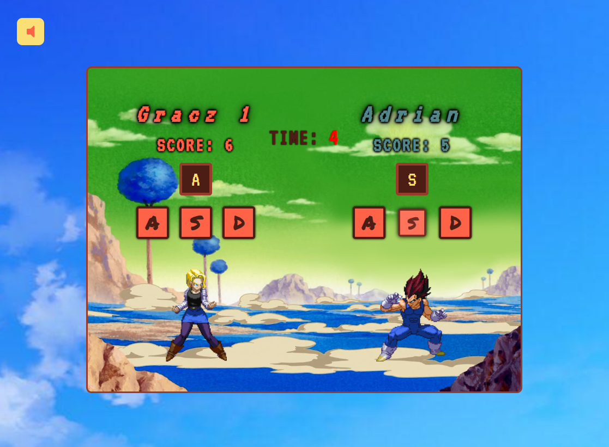

# Multi player reflex game 2018-2019

This project uses the firebase, for `multiplayer game in real time` :).  
The game is made for the desktop (current without RWD)
[DEMO here](https://gra-reflex.firebaseapp.com/#/)

## Table of contents
* [What is inside](#what-is-inside)
* [Screenshots](#screenshots)
* [Technologies](#technologies)
* [Under construction](#under-construction)
* [Setup](#setup)
* [Status](#status)

## What is inside
* _SPA_
* _Login panel_
* _Character selection_
* _Validation_
* _Current score and play for players in real time!_
* _Instruction_
* _Redirections, routing_
* _Error checking mechanism, like remove player(drop DB) at the right time_ 
* _Reacts to the `back button` or `F5`_
* _2 special containers: `NotFound` and `GameDisconnect`_
* _Score board_

## Screenshots

## Technologies
* React 16
* React Design Patterns like: Context API, Render Props
* React Router
* Firebase
* NPM like: Styled Components, Randomstring, Fontawesome
* Webpack
* Sass
* HTML, JS, and other..

## Under construction
- Add Redux
- TS
- Unit tests
- Regular expressions for validation
- Theme button with Context API

## Setup
1. Install Node.js -> [NodeJS](https://nodejs.org/en/)
2. Install all dependencies `npm install` -> Other modules are in `package.json`
3. Run `npm run start` to start a server(port 3000) and begin developing
4. Run `npm run build` to create a build

## Status
Project is: **Finished**
  Ready to play at the URL: [https://gra-reflex.firebaseapp.com/#/](https://gra-reflex.firebaseapp.com/#/)
