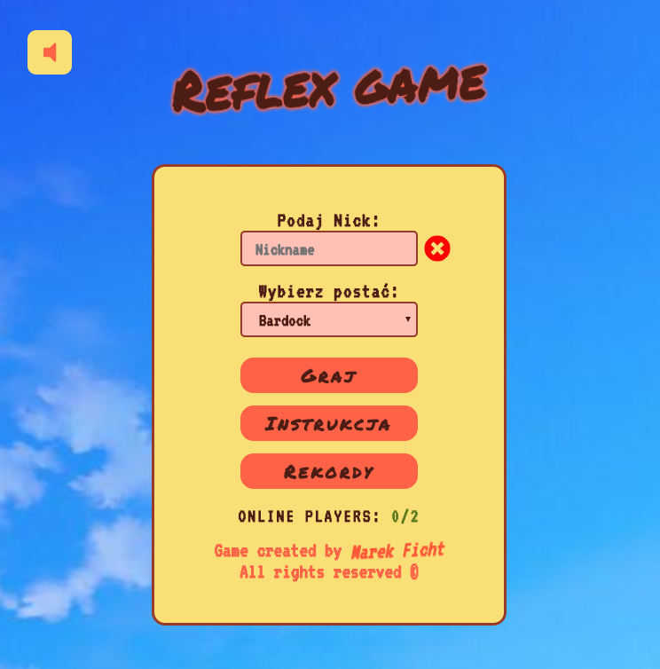

# Multi player reflex game.

This project uses the firebase, for `multiplayer game in real time` :). 

The game is made for the desktop (current without RWD)

<!--  -->

	
	

[DEMO here](https://gra-reflex.firebaseapp.com/#/)

Mechanism for game is simple. I focused more on correct game play, redirections, bug fixes, etc.

## What's inside?
* _SPA_
* _Login panel_
* _Character selection_
* _Validation_
* _Current score and play for players in real time!_
* _Instruction_
* _Redirections, routing_
* _Error checking mechanism, like remove player(drop DB) at the right time_ 
* _Reacts to the `back button` or `F5`_
* _2 special containers: `NotFound` and `GameDisconnect`_
* _Score board (**in the future**)_

## Under construction
- Own select box with avatars
- Maybe add fetch() and .json
- Regular expressions for validation
- Score board

## Installation and configuration

1. Install Node.js -> [NodeJS](https://nodejs.org/en/)
2. Install all dependencies `npm install` -> Other modules are in package.json
3. Run `npm run start` to start a server and begin developing
4. Run `npm run build` to create a build

## Built of ...

* React
* Webpack
* Sass
* React Router
* Firebase
* HTML, JS, and other..

## Further idea for development

I will add consistent layout and better colors. Possibility to choose theme for user.
Score board. And more a little details :).  
